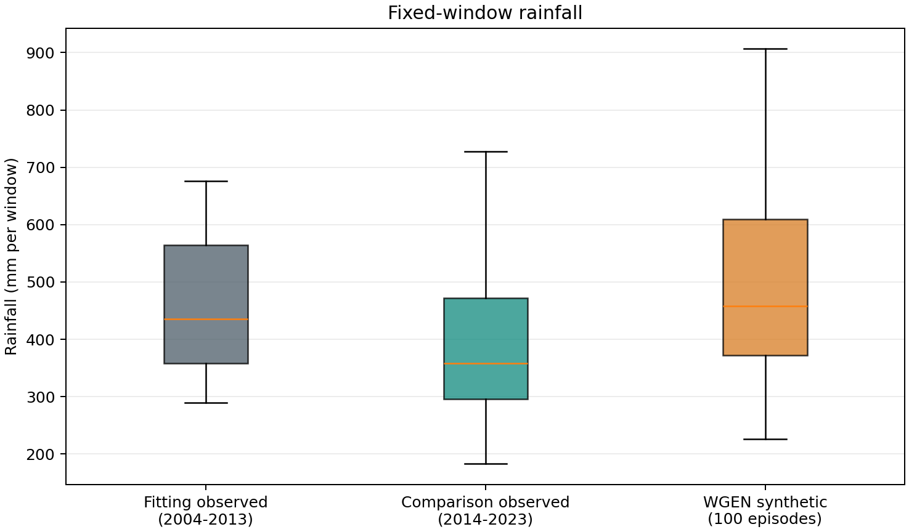
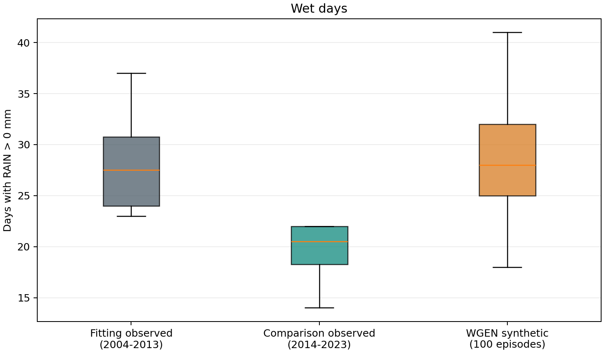
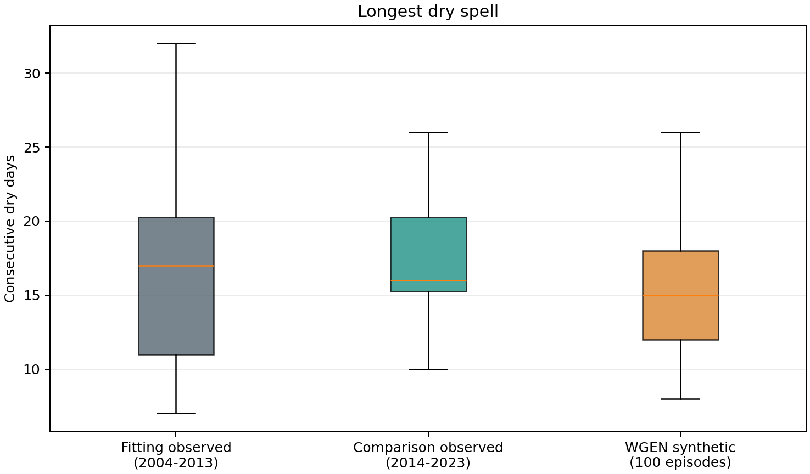
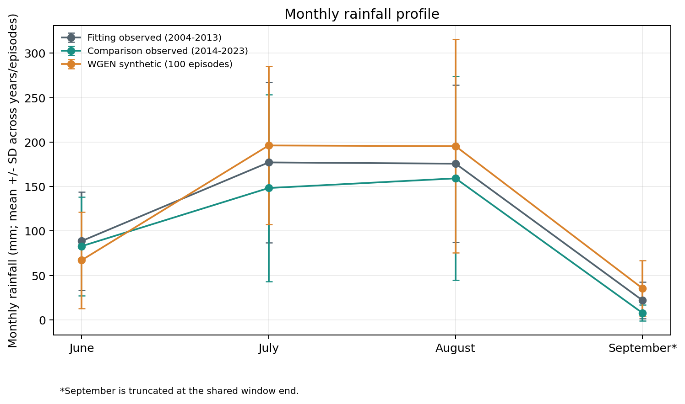
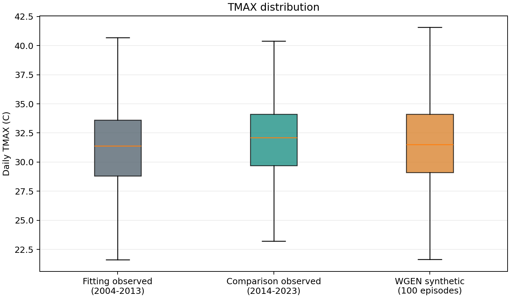
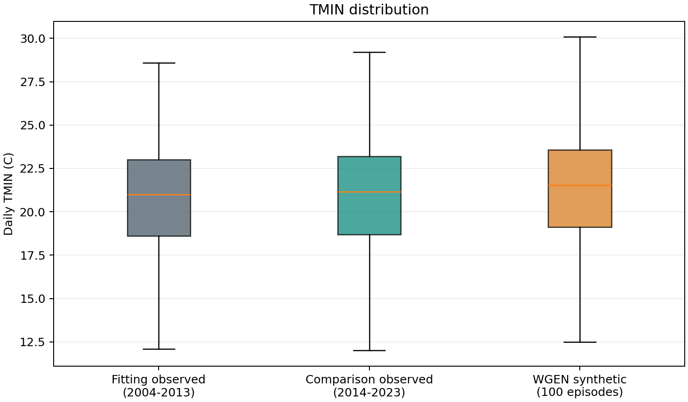
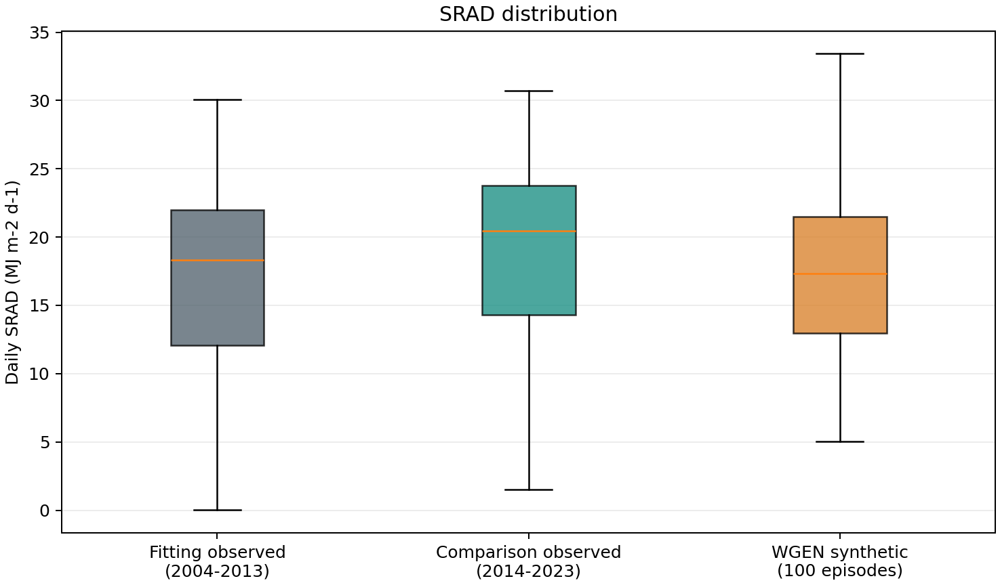
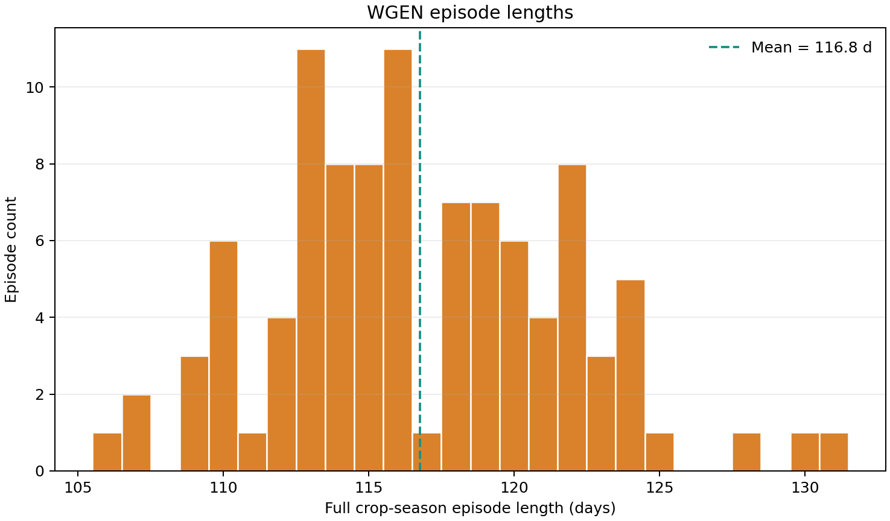

# YC WGEN 随机生长季天气 ensemble 验证

## 1. 为什么验证 episode-level 天气

本轮检验 Gym-DSSAT episode 中 DSSAT WGEN 实际提供给策略的随机生长季天气，不把未验证的 365/366 天导出路径作为前置门槛。episode 在作物成熟时终止，故不同 seed 的季长不同；气候主比较统一使用 **2008-06-01 至 2008-09-14（106 天）**，完整作物季只作暴露量辅助描述。

## 2. 与 Wang et al. 2025 的关系

采用“每个 RL episode 经 DSSAT WGEN 产生随机天气 realization”的方法学思路。Wang 等的论文使用不同地点、策略和实验设定，本工作不是逐项复现。参考：[Wang et al. (2025), AgriEngineering 7, 252](https://doi.org/10.3390/agriengineering7080252)。

## 3. 冻结的 WGEN 输入

- YC fitting weather：`results/yc_weather_gapfill_finalize/yc_wgen_fitting_weather_2004_2013.csv`，固定 hash 为 `4B8FFE9E881D0A0743921B78B9C0E0EBFB1D2D645C5AA9737948B2B088ED7B34`。
- 正式 CNYC.CLI：`results/yc_wgen_cli_pilot/003_06_05_02/final/CNYC.CLI`，SHA256 `65CF134600A5881706A5D435E1A09B276ED92A21FA5ABE2E18AAF63AF1E3A929`。
- 同一 YC FileX treatment 1、土壤、品种与管理；WTHER=W；random_weather=True；降雨湿日阈值为 RAIN > 0.0 mm。
- 未修改运行时、DSSAT binary、reward/action/observation、CLI 或拟合参数；未重新拟合 WGEN，也未运行 PPO。

## 4. Seed 设计

按预先设定运行完整 seed 1001–1100，共 100 个 episode；全部保留。预指定 seed 1001、1025、1050、1075、1100 各额外重跑一次。ppo_seed 不适用。

## 5. 固定共同窗口

优先窗口为 2008-06-01 至 2008-09-24，但 seed 中最早结束的是 106 天的 episode（2008-09-14）；因此按“100 个 synthetic episode 全部覆盖”的规则将窗口终点收窄为 **2008-09-14**。三组观察与 synthetic 均裁取逐日完整覆盖的相同月日。9 月为截断月份，不外推未覆盖日期。

## 6. Generation QC

结果：**100/100 PASS，0 FAIL**。逐集检查 DSSAT 成功、WGEN/random-weather 标志、weather_seed 注入、固定 CLI hash、状态行数、日期连续无重复、天气有限值、RAIN/SRAD 非负、TMAX >= TMIN。明细见 `episode_generation_qc.csv`。

## 7. 可复现性

固定 seed 重跑结果：**5/5 逐日天气完全一致**。比较日期和 RAIN/SRAD/TMAX/TMIN 四列；校验表 `weather_seed_reproducibility.csv`。

## 8. 多样性

全生长季天气序列哈希共有 **100/100 个唯一序列**。所有 seed 均计入，未基于天气观感筛选。逐 seed 哈希见 `weather_seed_diversity.csv`。

## 9. 降雨验证

固定窗口年/episode 累积降雨均值：fitting **463.54 mm**（10 年 SD 137.51，范围 289.70–675.50）；independent comparison **398.17 mm**（10 年，范围 182.70–727.80）；synthetic **494.22 mm**（100 集，范围 225.87–1066.02）。湿日均值 fitting/synthetic 分别为 29.00/28.70 天。降雨 gate：**PASS**。该 gate 同时参考 rain total/wet day 的 fitting 年际 SD 标准化偏差及月降雨型相关，规则写入 `summary.json`。

## 10. 温度验证

TMAX偏差 0.45 C，按 fitting 年际 SD 标准化 0.56，日 SD 比值 1.00；TMIN偏差 0.58 C，按 fitting 年际 SD 标准化 1.08，日 SD 比值 0.99。热尾阈值为 fitting 日值 TMAX P95=37.10 C，冷尾阈值为 fitting 日值 TMIN P05=14.09 C；阈值只作描述，不参与调参（频率及分位数见 `temperature_validation_summary.csv`）。温度 gate：**PASS_WITH_NOTES**。

## 11. SRAD 验证

fitting 与 synthetic 的生长季日平均 SRAD 分别为 16.94 与 17.19 MJ m-2 d-1；偏差为 fitting 年际 SD 的 0.37 倍，日 SD 比值 0.91。按月与分位数明细见 `srad_validation_summary.csv`。SRAD gate：**PASS**。

## 12. 相关结构

逐年/逐 episode 内分别计算 RAIN occurrence-SRAD、RAIN occurrence-TMAX、TMAX-TMIN、TMAX-SRAD 相关；lag-1 序列相关分别覆盖 TMAX、TMIN、SRAD 和 wet/dry 指示。Synthetic 相关：RAIN_occurrence_vs_SRAD：-0.49 (n=100)；RAIN_occurrence_vs_TMAX：-0.38 (n=100)；TMAX_vs_TMIN：0.53 (n=100)；TMAX_vs_SRAD：0.43 (n=100)。Synthetic lag-1：TMAX：0.58 (n=100)；TMIN：0.78 (n=100)；SRAD：0.28 (n=100)；wet_dry_occurrence：0.19 (n=100)。dependence gate：**PASS**。观察年只有 10 年，结果是描述性比较，不以单一 p 值定性。

## 13. 完整 crop-season 辅助统计

完整 episode 长度为 106–131 天，均值 116.8 天；每集另记录各自季节总雨量、湿日数、TMAX/TMIN/SRAD 均值及播种、开花、成熟日期，见 `full_crop_season_weather_by_seed.csv`。这些长度不一的累计量不用于 seed 间主气候比较。

## 14. Fitting 与 independent observed 对照

Fitting 数据仅为 2004–2013，来自冻结的参数拟合天气文件。2014–2023 WTH 只用于本轮独立于 WGEN fitting 的比较和报告，不用于拟合、阈值调节、seed 筛选或删除 episode。需限定：既有项目审计未将这些 2014–2023 文件认证为项目全局范围内完全未触碰的 pristine holdout；因此这里称“independent comparison”，不扩大声称。

## 15. 局限

历史样本每组只有 10 个年份，不能据此证明完整气候分布、年际尾部或未来气候已被充分覆盖；synthetic episode 来自同一 WGEN 参数化，100 个 realization 不是 100 个独立历史年份。比较只覆盖共同生长季窗口，不代表全年气候验证。WGEN 合理产生偏干、偏湿、偏热或偏凉 episode；单个 realization 偏离观察范围不自动判失败。

## 16. 最终判定

总体 episode weather quality：**PASS_WITH_NOTES**。系统性偏差筛查：**未发现按本轮预设描述性筛查规则需阻断的系统性偏差**。各 gate：generation=PASS；reproducibility=PASS；diversity=PASS；rainfall=PASS；temperature=PASS_WITH_NOTES；SRAD=PASS；dependence=PASS。

## 17. PPO readiness

`yc_random_weather_ready_for_ppo_pilot`：**YES**。通过只表示 WGEN episode-level 天气在本轮共同生长季描述性检验下足以进入受控 pilot，不意味着完美复现气候。

## 18. 下一步

若 gate 允许，下一任务为 **004_03 YC random-weather PPO pilot**。本轮没有启动 PPO。完整日历年 WGEN 输出路径仍为未验证状态，但 **full-year climatology validation: DEFERRED / OPTIONAL ADDITIONAL VALIDATION；full-year WGEN is not an episode-level random-weather PPO blocker**。

## 19. Git 状态

本报告、汇总表/图/脚本和逐 seed 天气 CSV 作为本任务产物进行本地提交，未推送到 GitHub。重复的逐运行状态、日志和 runtime snapshots 保留在本地工作区但不提交，以控制仓库体积；本任务目录的 `.gitignore` 仅忽略这些副本。最终提交号见任务终端摘要，未改动无关工作区文件。

## 产物导航

- 机器摘要：`summary.json`
- 逐集 QC：`episode_generation_qc.csv`
- 固定窗逐 seed：`fixed_window_weather_by_seed.csv`
- 完整季逐 seed：`full_crop_season_weather_by_seed.csv`
- 其余表：`rainfall_validation_summary.csv`、`monthly_rainfall_validation.csv`、`temperature_validation_summary.csv`、`srad_validation_summary.csv`、`cross_correlation_validation.csv`、`serial_correlation_validation.csv`、`weather_seed_reproducibility.csv`、`weather_seed_diversity.csv`
- 图片：`figures/`

图表：

